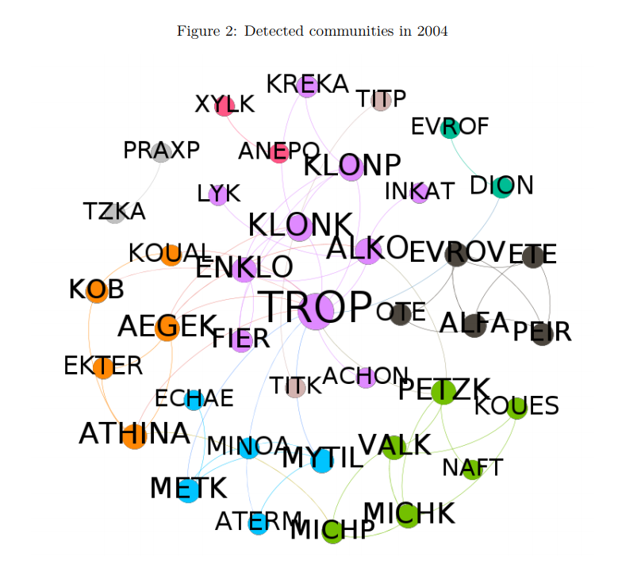

# Diving into the Greek Stock Market
> A Network Analysis Application

##Abstract

Social network analysis has become increasingly popular over the past few years. With the emergence of big data, modelling a real-world phenomenon as a network has never been more compelling. The findings of this paper act as supporting evidence to the claim that social network analysis is capable of providing with insights into underlying trends as well as forecasting future behavior within the network. 

In this study, we build a network for the Greek stock market based on the correlation of different stock returns. We investigate all stocks in the Greek Stock Market for years 2000 to 2017. These networks are visualized and evaluated using Social Network Analysis methods. Gephi is used in order to detect evolving communities during different time periods and review the structure of the network in the aftermath of the financial crisis. Furthermore, we present a centrality-based portfolio management strategy which is found to be superior to a random portfolio selection.

## Authors

Zosimadis Ilias - [@ensozos](https://github.com/ensozos) - zosimadi@csd.auth.gr
Deliakos Ioannis -[@iodel](https://github.com/iodel) - deliakos@csd.auth.gr

## License

This project is licensed under the MIT License - see the LICENSE.md file for details
